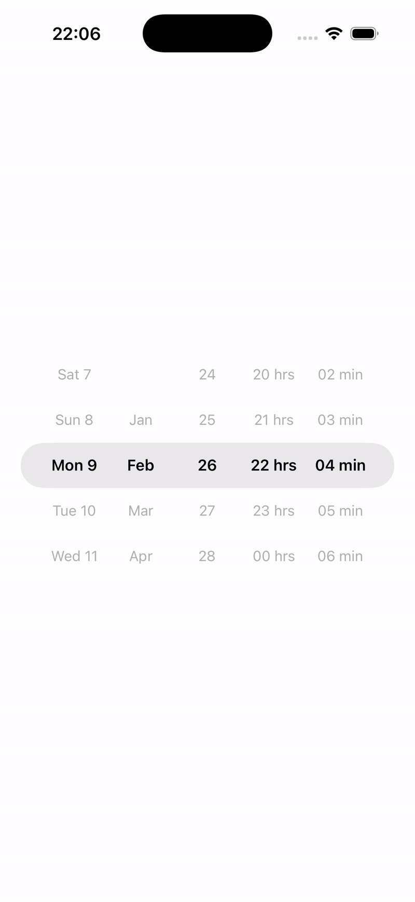

## 📸 How it looks

<p align="center">
  
</p>


# React Native Wheel DateTime Picker

A fully customizable **wheel-based Date & Time Picker** for React Native.  
Built from scratch with smooth scrolling, min/max date constraints, infinite wheels, and **full TypeScript support**.

Unlike modal-based pickers, this component is designed to be **embedded directly in your UI**, making it ideal for booking flows, forms, schedulers, and custom designs.

---

## ✨ Features

- 🌀 Smooth wheel-based scrolling (iOS-style)
- 📅 Date & time selection in one component
- ⏱ Supports **12h / 24h** formats
- 🔒 Min / Max date limits (auto-clamping)
- 🔁 Infinite scrolling wheels
- 🧠 Intelligent day handling (Feb, leap years, etc.)
- 🎨 Highly customizable styles
- 🧩 Fully typed with TypeScript
- ⚡ No native modules, no dependencies

---

## 📦 Installation

```sh
npm install react-native-wheel-datetime-picker
````

or

```sh
yarn add react-native-wheel-datetime-picker
```

---

## 🚀 Basic Usage

```tsx
import { DateTimePicker } from "react-native-wheel-datetime-picker";

export default function App() {
  return (
    <DateTimePicker
      initial={new Date()}
      onChange={(date) => {
        console.log("Selected:", date);
      }}
    />
  );
}
```

---

## 🧠 How It Works

* Each unit (day, month, year, hours, minutes) is a **wheel**
* Wheels snap to rows for precise selection
* When a value goes outside `start` / `end`, it is **clamped**
* Wheels automatically **roll back** to the nearest valid value
* Day count updates automatically when month/year changes

---

## 🧩 Props

### `DateTimePickerProps`

| Prop                     | Type                      | Required | Description                           |
| ------------------------ | ------------------------- | -------- | ------------------------------------- |
| `initial`                | `Date`                    | ✅        | Initial selected date                 |
| `start`                  | `Date`                    | ❌        | Minimum selectable date               |
| `end`                    | `Date`                    | ❌        | Maximum selectable date               |
| `onChange`               | `(date: Date) => void`    | ❌        | Called on every valid change          |
| `format`                 | `DateTimeFormat`          | ❌        | Controls display & time format        |
| `height`                 | `number`                  | ❌        | Height of a single row (default `44`) |
| `numRows`                | `number`                  | ❌        | Visible rows (default `5`)            |
| `fontFamily`             | `string`                  | ❌        | Font family for text                  |
| `textSizeActive`         | `number`                  | ❌        | Font size for selected item           |
| `textSizeInActive`       | `number`                  | ❌        | Font size for inactive items          |
| `textWeightActive`       | `TextStyle["fontWeight"]` | ❌        | Font weight for selected item         |
| `textWeightInActive`     | `TextStyle["fontWeight"]` | ❌        | Font weight for inactive items        |
| `selectorContainerStyle` | `ViewStyle`               | ❌        | Style for the selection highlight     |

---

## 🎛 Format Options

### `DateTimeFormat`

```ts
type DateTimeFormat = {
  day?: "numeric" | "alphabetical";
  month?: "numeric" | "alphabeticalShort" | "alphabeticalLong";
  year?: "short" | "long";
  timeFormat?: 12 | 24;
  hours?: "hh" | "h";
  minutes?: "mm" | "m";
};
```

### Example

```tsx
<DateTimePicker
  initial={new Date()}
  format={{
    day: "alphabetical",
    month: "alphabeticalShort",
    year: "long",
    timeFormat: 12,
    hours: "hh",
    minutes: "mm",
  }}
/>
```

---

## ⏱ Min / Max Date Example

```tsx
<DateTimePicker
  initial={new Date()}
  start={new Date(2024, 0, 1)}
  end={new Date(2026, 11, 31, 23, 59)}
  onChange={(date) => console.log(date)}
/>
```

✔ If the user scrolls outside limits, the picker **automatically snaps back**.

---

## 🧪 TypeScript Support

All props are fully typed and exported.

```ts
import type {
  DateTimePickerProps,
  DateTimeFormat,
  WheelProps,
} from "react-native-wheel-datetime-picker";
```

You get:

* IntelliSense
* Auto-complete
* Compile-time safety

---

## 🧱 Architecture Overview

* `DateTimePicker`
  Manages state, date logic, validation, and clamping

* `Wheel`
  Generic wheel component using `FlatList` + snapping

* `types.ts`
  Public API types for consumers

No context, no Redux, no magic — just clean React.

---

## ⚠️ Notes

* This is a **controlled internal picker**, not modal-based
* Designed for **embedded UI**, not dialogs
* Works on both **Android & iOS**
* No native code required

---

## 📄 License

MIT License © 2026

---

## 🙌 Contributing

PRs and issues are welcome.
If you find a bug or want a feature, open an issue.

---

## ⭐ Why This Exists

Most date pickers are:

* modal-only
* hard to style
* poorly typed
* over-engineered

This library is built for **control, clarity, and composability**.

---

Happy building 🚀
